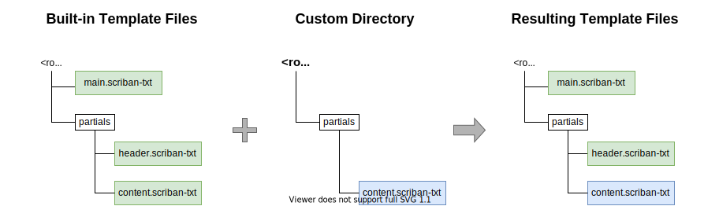

<!--
  <auto-generated>
    The contents of this file were generated by a tool.
    Any changes to this file will be overwritten.
    To change the content of this file, edit 'default.md.scriban'
  </auto-generated>
-->
# Default Template

The default template renders the change log to a Markdown file.
It is the most generic template and should work in most Markdown implementations.

For configuration options, see [Default Template Settings](../configuration/settings/default-template.md).

## Customization

The "Default" template is implemented using [Scriban](https://github.com/scriban/scriban/) and is split into multiple files.

The generated change log can be customized by replacing one or more of the template's files.
To achieve that, specify a "Custom Directory" in the template's settings (see [Custom Directory setting](../configuration/settings/default-template.md#custom-directory)), e.g. in the configuration file:

```json
{
    "changelog" : {
        "template" : {
            "default" : {
                "customDirectory" : "./custom_theme"
            }
        }
    }
}
```

ChangeLog uses a virtual file system to load the template's files.



If a "custom directory" is specified, the files in this directory are "overlayed" over the template's built-in files:

- If a file exists in the "custom directory", it is used instead of the file at the same location in the template's default file
- If a file only exists in the template's built-in files, the built-in file is used.
  Thus, you only need to place the files you wish to override in the custom directory.

To override a file, the "custom directory" must use the file & directory structure defined by the template's built-in files. 
The "Default" template includes the following files:

```txt
<root>
 ├─helpers
 │  ├─entry-id.scriban-txt
 │  ├─entry-title.scriban-txt
 │  └─text-element.scriban-txt
 ├─partials
 │  ├─version
 │  │  ├─details
 │  │  │  ├─entry-header.scriban-txt
 │  │  │  ├─entry.scriban-txt
 │  │  │  ├─version-details-header.scriban-txt
 │  │  │  └─version-details.scriban-txt
 │  │  ├─summary
 │  │  │  ├─breakingchanges-list-header.scriban-txt
 │  │  │  ├─breakingchanges-list.scriban-txt
 │  │  │  ├─entry-list-header.scriban-txt
 │  │  │  ├─entry-list.scriban-txt
 │  │  │  └─version-summary.scriban-txt
 │  │  ├─version-header.scriban-txt
 │  │  └─version.scriban-txt
 │  ├─changelog.scriban-txt
 │  ├─content.scriban-txt
 │  └─header.scriban-txt
 └─main.scriban-txt
```

- The entry point of the template is `main.scriban-txt`
- In `main.scriban-txt`, Scriban's `include` feature is used to import the other files at the appropriate locations
- The paths of the imported files are defined *in* the template files. 
  This means, that additional files that do not exist in the set of built-in files can be placed in the custom directory and then be imported from one of the overridden files.
  Theoretically, you can build a completely custom template by replacing `main.scriban-txt` with a version that only uses files from the custom directory.

You can browse the template's built-in files [here](../../src/ChangeLog/Templates/Default/_Resources)

## Version support

- Support for templates and the "Default" template was introduced in version 0.2.  
- The option to customize the template by overriding individual files was added in version 0.4.

## See Also
 
- [Templates Overview](./README.md)
- [Default Template Settings](../configuration/settings/default-template.md)
- [Scriban](https://github.com/scriban/scriban/)